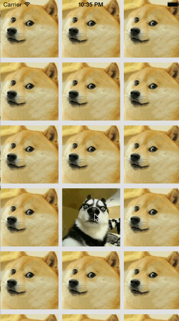

# HYAwesomeTransition

Custom transition between viewcontrollers.

The idea comes from gewara(格瓦拉).



## Requirements

iOS 7.0 +


## Example

```objc 
self.awesometransition = [[HYAwesomeTransition alloc] init];
self.awesometransition.duration = 2.0f;
self.awesometransition.containerBackgroundView = customView;
[self.awesometransition registerStartFrame:startFrame
                                finalFrame:finalFrame
                            transitionView:cell];

[self presentViewController:vc animated:YES completion:^{
        vc.avatar.hidden = NO;
}];
```

Implement `UIViewControllerTransitioningDelegate` and this delegate method:

```objc 
- (id <UIViewControllerAnimatedTransitioning>)animationControllerForPresentedController:(UIViewController *)presented presentingController:(UIViewController *)presenting sourceController:(UIViewController *)source
{
    self.awesometransition.present = YES;
    return self.awesometransition;
}

- (id<UIViewControllerAnimatedTransitioning>)animationControllerForDismissedController:(UIViewController *)dismissed
{
    self.awesometransition.present = NO;
    return self.awesometransition;
}
```

If you use `UINavigationController`，you have to implement `UINavigationControllerDelegate` instead of `UIViewControllerTransitioningDelegate`, but interactive gesture is not suppored yet.

```objc 
- (id <UIViewControllerAnimatedTransitioning>)navigationController:(UINavigationController *)navigationController
                                   animationControllerForOperation:(UINavigationControllerOperation)operation
                                                fromViewController:(UIViewController *)fromVC
                                                  toViewController:(UIViewController *)toVC{
    if (operation != UINavigationControllerOperationPush) {
        self.awesometransition.present = NO;
    }else{
        self.awesometransition.present = YES;
    }

    return self.awesometransition;
}
```

## License

HYAwesomeTransition is available under the MIT license. See the LICENSE file for more info.